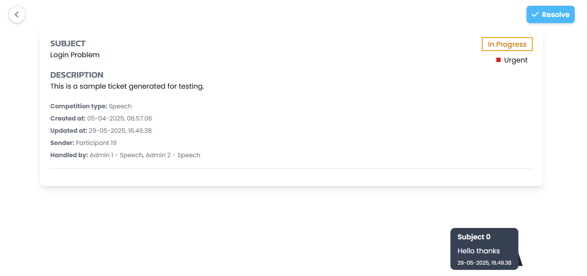

# WADS Final Project - NMC

**Group:** Raft

**Class:** L4AC

**Members:**
- Ella Raputri (2702298154)
- Ellis Raputri (2702298116)
- Rafael Anderson (2702255981)
- Albertus Santoso (2702334885)

**Client Deployment Link:** [Click here](https://e2425-wads-l4acg2-client.csbihub.id/)

**Documentation:** [Click here](https://drive.google.com/drive/u/2/folders/1cZ49t_OAud7zZ-THoBlakrTnvxpTbx2M)

 

## Project Description
NMC (National Mandarin Competition) is one of the annual events held by BNMC (BINUS Mandarin Club) with the goal of improving one's Chinese skills, and to preserve Chinese culture. This app aims to function as a competition management system, as well as a helpdesk ticketing for issues related to the competitions. There are 3 main roles, which are guest (not logged in), participant, and admin. To unlock all the features, a guest can sign in as a participant. 

 

## Pages and Features

&ensp;<b>Welcome Page (Guest) </b>

- The Welcome Page is a landing page for users when first accessing the NMC management system (if not logged in before). 

- Features:
    - Cover image page with parallax scrolling.
    - About us section.
    - List of competitions in carousel.
    - Contact us section.

- Here are some images of this page:

   

   

   

   

 

 

&ensp;<b>Login/Register Page (Guest) </b>

- The Login/Register Page is the page for guest users to login as admin or participant and also sign up as a participant. 

- Features:
    - Sign in to existing account as participant or admin.
    - Sign up as a new participant (will be prompted to verify account through OTP).
    - Sign in or sign up using Google (will be prompted to fill additional info if needed for sign up).
    - Reset password (password will be reset using OTP).

- Here are some images of this page:

   
   
   
 

 

&ensp;<b>Home Page (Participant) </b>

- The Home Page is the landing page for users that logged in as participant. 

- Features:
    - View details of the user themselves.
    - See upcoming competitions in their schedules and their registration status (pending, accepted, or rejected).

- Here are some images of this page:

   
   

 

 

&ensp;<b>Competition Page (Guest and Participant) </b>

- The Competition Page is a page for users to know details of the competitions in NMC and register to them. 

- Features for Guest and Participant:
    - View list of competitions.
    - View each competition details.

- Features for Participant:
    - Register to the competition.

- Here are some images of this page:

   
   
   

 

 

&ensp;<b>Help Page (Guest and Participant) </b>

- The Help Page is the page that users can use to seek help or information regarding NMC. 

- Features for Guest and Participant:
    - View FAQ of NMC.
    - Message the chatbot to ask about NMC.

- Features for Participant:
    - Chat history with chatbot are saved.
    - Create new ticket to ask for admin help.
    - Chat with the admin about the ticket.
    - Rate the ticket experience after closing it.
    - Image can also be sent in the message.

- Here are some images of this page:

   
   
   
   
   
   

 

 

&ensp;<b>Admin Dashboard Page (Admin) </b>

- The Admin Dashboard Page is the redirected page when admin first logged in into their account. 

- Features:
    - View metrics and data related to the competition type of the admin in NMC based on the chosen date in the calendar.
    - Download the data.

- Here are some images of this page:

   
   

 

 

&ensp;<b>Admin Competition Page (Admin) </b>

- The Admin Competition Page is the page where admin manages competition registration of participants. 

- Features:
    - View all competition registrations for a specific competition type and support filters.
    - Download the data.
    - View details of the registration, give comments to participant, and accept or reject it.

- Here are some images of this page:

   
   
 

 

&ensp;<b>Admin Ticket Page (Admin) </b>

- The Admin Ticket Page is the page where admin manages tickets from participants. 

- Features:
    - View all tickets for a specific competition type and support filters.
    - Download the data.
    - View details of the ticket and resolve it.
    - Collaborate with admins for the same competition type on a ticket.
    - Communicate with the participant regarding their tickets.
    - Image can also be sent in the message.

- Here are some images of this page:

   
   
   
   
 

 

 

## Contact Information

If you have any questions or feedback, please kindly contact us:
- Instagram: [Click here](https://instagram.com/raputriella?igshid=OGQ5ZDc2ODk2ZA==)
- Whatsapp: [Click here](https://wa.me/62895629504490)
- Phone number: +62895629504490